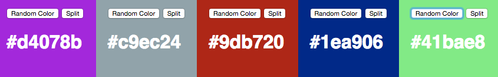

js-play
=======

This is just a javascript playground. Currently we're Making little one pagers:

#Color Scheme Designer



The fun little algorithm,

```js
          function rhex(){
            var letters = '0123456789abcdef'.split('');
            var hexString = '';
            for (var i = 0; i < 6; i++) {
              hexString += letters[Math.ceil(Math.random()*100)%16];
            };
            return hexString;
        }
  ```
